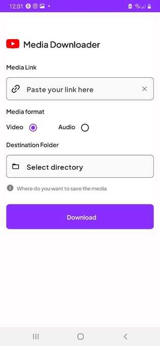

# MediaDownloader
Android app to download any media (video/audio) off the internet from most websites (YouTube, Vimeo, etc.)

## Screenshots
 

## Technical Details
- Aesthetic, smooth and creative UI
- Developed strictly on **MVVM architecture**
- Utilised Dagger Hilt dependency injection
- Utilised yt_dlp python library and integrated in the Android environment using Chaquopy SDK.
- Utilised DownloadManager to download the file from the URL while running it in background service using CoroutineWorker (WorkManager API)
- Utilised Figma to design the UI
- Utilised FFMpeg library to convert video MP4 file to high quality audio MP3.
- User can save at any location in their phone storage.

## Libraries and Frameworks
- [Jetpack Compose (Material 3)](https://developer.android.com/jetpack/compose/designsystems/material3)
- [Dagger Hilt Dependency Injection](https://developer.android.com/training/dependency-injection/hilt-android)
- [yt_dlp](https://github.com/yt-dlp/yt-dlp)
- [Chaquopy](https://chaquo.com/chaquopy/)
- [DownloadManager](https://developer.android.com/reference/android/app/DownloadManager)
- [WorkManager](https://developer.android.com/topic/libraries/architecture/workmanager)
- [FFMPeg](https://github.com/bravobit/FFmpeg-Android)
